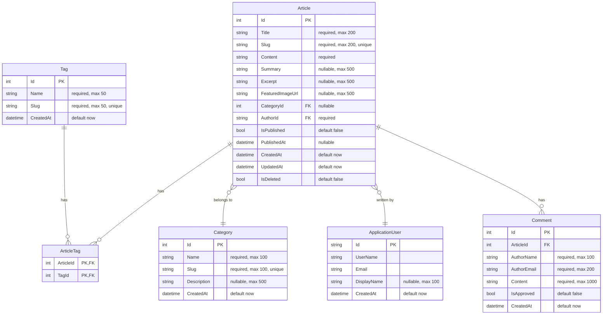

# Article データベース設計ドキュメント

## 概要

このドキュメントは、ブログアプリケーションのArticle（記事）関連のデータベース設計について記述しています。

---

## ER図



---

## テーブル定義

### Articles テーブル

ブログ記事の本体を管理するメインテーブル。

| カラム名 | データ型 | Null許可 | 制約 | 説明 |
|----------|----------|----------|------|------|
| Id | INTEGER | NO | PK, AUTO INCREMENT | 記事の一意識別子 |
| Title | TEXT | NO | max 200 | 記事タイトル |
| Slug | TEXT | NO | max 200, UNIQUE | URL用スラッグ（`^[a-z0-9\-]+$`形式） |
| Content | TEXT | NO | - | 記事本文（Markdown形式） |
| Summary | TEXT | YES | max 500 | 記事要約 |
| Excerpt | TEXT | YES | max 500 | 抜粋文 |
| FeaturedImageUrl | TEXT | YES | max 500 | アイキャッチ画像URL |
| CategoryId | INTEGER | YES | FK → Categories.Id | カテゴリID |
| AuthorId | TEXT | NO | FK → AspNetUsers.Id | 著者ユーザーID |
| IsPublished | INTEGER | NO | default 0 | 公開フラグ（0:下書き, 1:公開） |
| PublishedAt | TEXT | YES | - | 公開日時 |
| CreatedAt | TEXT | NO | default datetime('now') | 作成日時 |
| UpdatedAt | TEXT | NO | default datetime('now') | 更新日時 |
| IsDeleted | INTEGER | NO | default 0 | 論理削除フラグ（0:有効, 1:削除済） |

**インデックス:**
- `IX_Articles_Slug` (UNIQUE)
- `IX_Articles_CategoryId`
- `IX_Articles_AuthorId`
- `IX_Articles_PublishedAt`
- `IX_Articles_IsPublished_IsDeleted` (複合インデックス)

**外部キー制約:**
- `CategoryId` → `Categories.Id` (ON DELETE RESTRICT)
- `AuthorId` → `AspNetUsers.Id` (ON DELETE RESTRICT)

---

### Categories テーブル

記事のカテゴリを管理するテーブル。

| カラム名 | データ型 | Null許可 | 制約 | 説明 |
|----------|----------|----------|------|------|
| Id | INTEGER | NO | PK, AUTO INCREMENT | カテゴリの一意識別子 |
| Name | TEXT | NO | max 100 | カテゴリ名 |
| Slug | TEXT | NO | max 100, UNIQUE | URL用スラッグ |
| Description | TEXT | YES | max 500 | カテゴリ説明 |
| CreatedAt | TEXT | NO | default datetime('now') | 作成日時 |

**インデックス:**
- `IX_Categories_Slug` (UNIQUE)

---

### Tags テーブル

記事に付与するタグを管理するテーブル。

| カラム名 | データ型 | Null許可 | 制約 | 説明 |
|----------|----------|----------|------|------|
| Id | INTEGER | NO | PK, AUTO INCREMENT | タグの一意識別子 |
| Name | TEXT | NO | max 50 | タグ名 |
| Slug | TEXT | NO | max 50, UNIQUE | URL用スラッグ |
| CreatedAt | TEXT | NO | default datetime('now') | 作成日時 |

**インデックス:**
- `IX_Tags_Slug` (UNIQUE)

---

### ArticleTags テーブル（中間テーブル）

ArticleとTagの多対多関係を管理する中間テーブル。

| カラム名 | データ型 | Null許可 | 制約 | 説明 |
|----------|----------|----------|------|------|
| ArticleId | INTEGER | NO | PK, FK → Articles.Id | 記事ID |
| TagId | INTEGER | NO | PK, FK → Tags.Id | タグID |

**外部キー制約:**
- `ArticleId` → `Articles.Id` (ON DELETE CASCADE)
- `TagId` → `Tags.Id` (ON DELETE CASCADE)

---

### Comments テーブル

記事へのコメントを管理するテーブル。

| カラム名 | データ型 | Null許可 | 制約 | 説明 |
|----------|----------|----------|------|------|
| Id | INTEGER | NO | PK, AUTO INCREMENT | コメントの一意識別子 |
| ArticleId | INTEGER | NO | FK → Articles.Id | 記事ID |
| AuthorName | TEXT | NO | max 100 | コメント投稿者名 |
| AuthorEmail | TEXT | NO | max 200 | 投稿者メールアドレス |
| Content | TEXT | NO | max 1000 | コメント内容 |
| IsApproved | INTEGER | NO | default 0 | 承認フラグ（0:未承認, 1:承認済） |
| CreatedAt | TEXT | NO | default datetime('now') | 作成日時 |

**インデックス:**
- `IX_Comments_ArticleId`

**外部キー制約:**
- `ArticleId` → `Articles.Id` (ON DELETE CASCADE)

---

## リレーションシップ

### 1. Article ⟷ Category（多対一）
- 1つの記事は0個または1個のカテゴリに属する
- 1つのカテゴリは複数の記事を持てる
- CategoryIdはnullableのため、カテゴリ未設定の記事も許可

### 2. Article ⟷ ApplicationUser（多対一）
- 1つの記事は必ず1人の著者を持つ
- 1人のユーザーは複数の記事を書ける
- 著者削除時は記事を残すためRESTRICT

### 3. Article ⟷ Tag（多対多）
- ArticleTagsテーブルで中間テーブルを実装
- 複合主キー（ArticleId, TagId）
- 記事削除時・タグ削除時にCASCADE削除

### 4. Article ⟷ Comment（一対多）
- 1つの記事は複数のコメントを持てる
- 記事削除時にコメントもCASCADE削除

---

## 設計パターン

### ソフトデリート（論理削除）
`Article`エンティティは`IsDeleted`フラグを使用した論理削除パターンを採用。
- 物理削除せずデータを保持
- 公開記事取得時は`IsDeleted == false`でフィルタリング

### スラッグベースURL
すべてのエンティティ（Article, Category, Tag）でスラッグを使用。
- URL例: `/articles/my-first-blog-post`
- 正規表現: `^[a-z0-9\-]+$`
- UNIQUE制約で一意性を保証

### タイムスタンプ
- `CreatedAt`: レコード作成時に自動設定
- `UpdatedAt`: レコード更新時にサービス層で設定（Articleのみ）

---

## サービス層でのクエリパターン

### ナビゲーションプロパティのInclude

記事取得時は常に関連エンティティをIncludeする：

```csharp
// 基本的な記事取得パターン
await _context.Articles
    .Include(a => a.Author)
    .Include(a => a.Category)
    .Include(a => a.ArticleTags)
        .ThenInclude(at => at.Tag)
    .ToListAsync();
```

### 公開記事フィルタリング

```csharp
// 公開済み記事のみ取得
.Where(a => a.IsPublished && a.PublishedAt <= DateTime.UtcNow)
```

### 承認済みコメントのみ取得

```csharp
// スラッグで記事取得時、承認済みコメントのみInclude
.Include(a => a.Comments.Where(c => c.IsApproved))
```

---

## 初期データ（シードデータ）

### カテゴリ初期データ

| Name | Slug | Description |
|------|------|-------------|
| 技術 | tech | プログラミングや技術に関する記事 |
| 日記 | diary | 日常の出来事や雑記 |
| お知らせ | news | サイトからのお知らせ |

---

## マイグレーション履歴

| 日付 | マイグレーション名 | 内容 |
|------|-------------------|------|
| 2024-11-08 | InitialCreate | 初期スキーマ作成 |
| 2024-11-08 | AddIdentityRoles | Identity ロール追加 |
| 2024-11-08 | AddArticleManagementFeatures | ArticleTags複合キー変更、Excerpt追加、CategoryId nullable化 |

---

## 参照ファイル

| 目的 | ファイルパス |
|------|-------------|
| エンティティ定義 | `Models/Entities/Article.cs` |
| DbContext設定 | `Data/ApplicationDbContext.cs` |
| シードデータ | `Data/DbInitializer.cs` |
| 記事サービス | `Services/ArticleService.cs` |
| サービスインターフェース | `Services/IArticleService.cs` |
